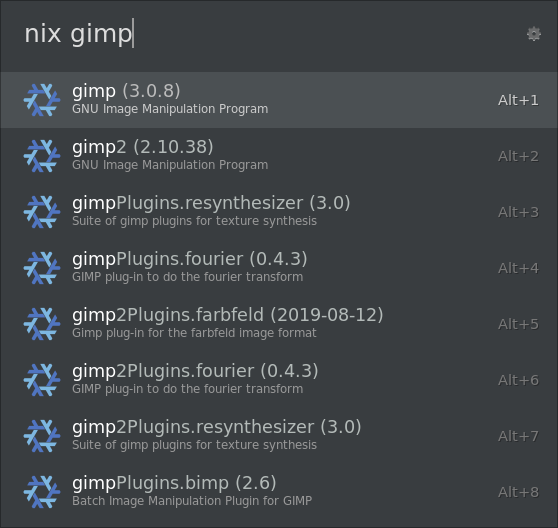
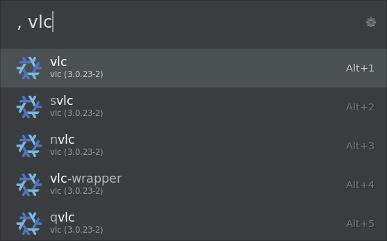

# Ulauncher nix package search

Useful actions for working with Nix(OS) system or environments. Lets you search for packages and/or instantly run program without installing them.

## Features

### Look up packages

By default bound to the `nix` prefix.

Search for packages like you would on [search.nixos.org](https://search.nixos.org/packages). Selecting a package with Enter opens it in the browser.

### Look up and run packages

By default bound to the `,` prefix.

Search for executables in packages. Selecting a package with Enter runs it using `nix shell nixpkgs#pname -c executable`.

You need to have `nix-command` and `flakes` experimental features enabled in nix and a `nixpkgs` flake in your system's nix registry (`nix registry --list`).

## Acknowledgements

Inspired by the [NixPkgs Search](https://www.raycast.com/aiotter/nixpkgs-search) Raycast extension.
Run-without-installing inspired by [comma](https://github.com/nix-community/comma).
